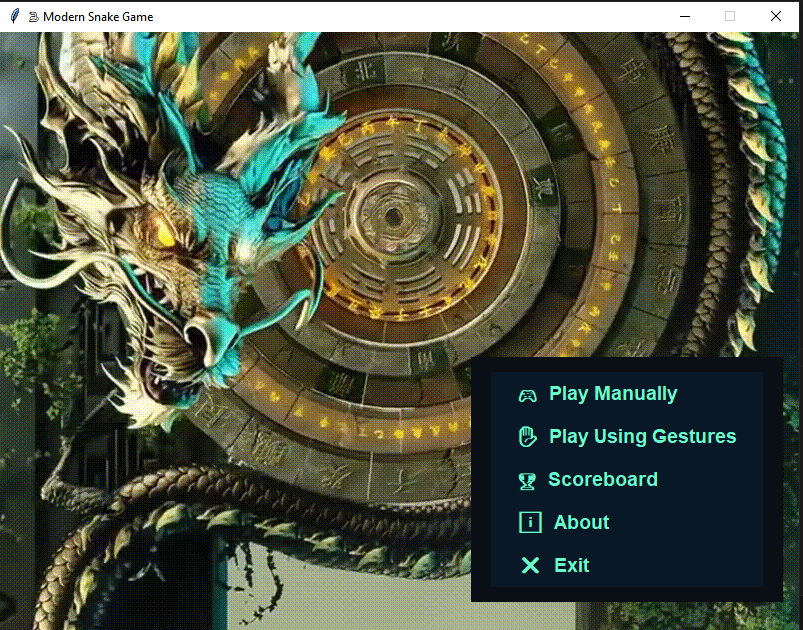
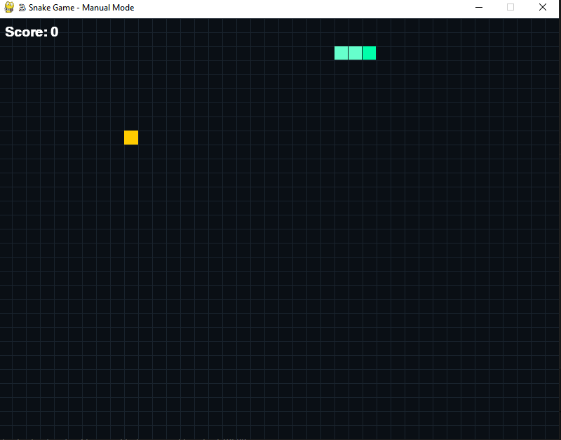
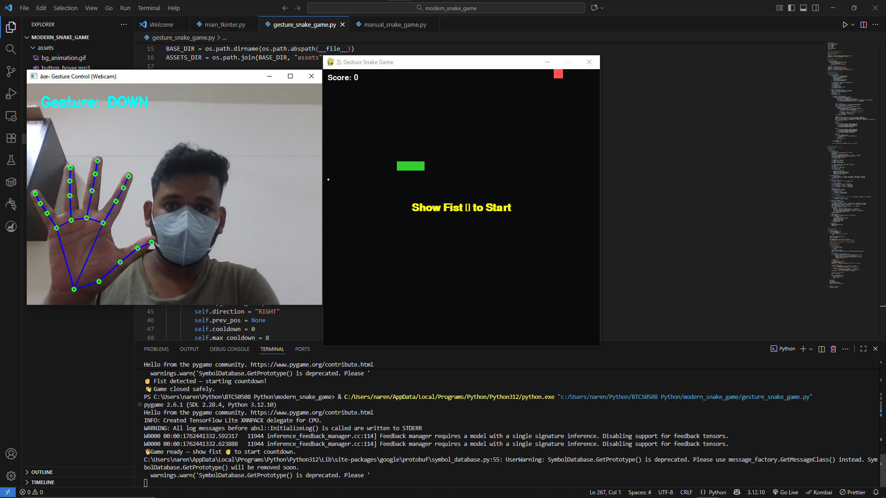

# 🐍 Modern Snake Game with Gesture Control

### 🎮 Overview
The **Modern Snake Game with Gesture Control** reimagines the classic Snake Game using modern AI and computer vision technologies.  
Developed in **Python**, it combines **Tkinter**, **Pygame**, **OpenCV**, and **MediaPipe** to deliver two modes of gameplay:

- **Manual Mode:** Play the traditional Snake Game using keyboard inputs.
- **Gesture Mode:** Use your hand gestures (detected via webcam) to control the snake in real time.

This project bridges classic entertainment with modern AI-driven interactivity, demonstrating Python’s capability to integrate GUI, multimedia, and machine learning into one engaging application.

---

### ⚙️ Features

✅ Animated home screen with a looping video background and background music  
✅ Two gameplay modes — **Manual** and **Gesture-Controlled**  
✅ Real-time hand tracking using **MediaPipe Hands**  
✅ Smooth countdown before gesture-based start  
✅ Interactive sound effects (start, eat, game-over)  
✅ Modular, clean, and scalable Python architecture  
✅ Optimized for smooth frame rates and low latency

---

### 🧠 Technologies Used

| Category | Library / Tool |
|-----------|----------------|
| GUI | Tkinter |
| Game Engine | Pygame |
| Computer Vision | OpenCV |
| Hand Tracking | MediaPipe |
| Audio System | Pygame.mixer |
| Image Processing | Pillow |
| Language | Python 3.12 |

---

### 💻 Hardware and Software Requirements

The project requires standard computing resources and essential Python libraries for smooth execution.  
This configuration ensures stable frame rates, responsive gesture tracking, and consistent performance.

**Hardware:**
- Computer or laptop with at least **4 GB RAM**
- Integrated or external **webcam** for gesture input
- Basic graphics support for smooth rendering

**Software:**
- **Python 3.7+**
- Libraries: `OpenCV`, `MediaPipe`, `Pygame`, `NumPy`, `Tkinter`
- OS: Windows / Linux / macOS

---

### 📦 Installation and Setup


1️⃣ **Clone the repository**
```bash
cd modern-snake-game
```
```bash
git clone https://github.com/NarendraM45/modern-snake-game.git

````
2️⃣ **Install dependencies**

```bash
pip install -r requirements.txt
```

3️⃣ **Run the game**

```bash
python main_tkinter.py
```

---

### 📂 Project Structure

```
modern-snake-game/
│
├── assets/                     # All media assets (music, GIFs, etc.)
│   ├── bg_animation.gif
│   ├── start_music.mp3
│   ├── button_hover.mp3
│   ├── game_start.mp3
│   ├── game_over.mp3
│   ├── eat_point.mp3
│   └── your_video.mp4
│
├── main_tkinter.py             # Home screen and navigation logic
├── manual_snake_game.py        # Manual mode logic using Pygame
├── gesture_snake_game.py       # Gesture-based mode using OpenCV + MediaPipe
├── requirements.txt            # Required dependencies
├── README.md                   # Project documentation
├── .gitignore                  # Files to ignore in Git
└── LICENSE                     # MIT License
```

---

### 📸 Screenshots

| Home Screen                | Manual Mode                | Gesture Mode                 |
| -------------------------- | -------------------------- | ---------------------------- |
|  |  |  |

---

### 🧩 Future Enhancements

🚀 Planned improvements for upcoming versions:

* Multi-hand or finger-specific gesture support
* AI-based adaptive gesture calibration
* Adjustable difficulty and dynamic snake speed
* Mobile or web port (using **Flask** or **Kivy**)
* Leaderboard and multiplayer support

---

### 🧾 License

This project is licensed under the **MIT License** – see the [LICENSE](LICENSE) file for details.
You are free to use, modify, and distribute this software with attribution.

---

### 👨‍💻 Author

**Narendra Mishra**
🎓 B.Tech CSIT – 3rd Year
📍 India

🔗 **GitHub:** [NarendraM45](https://github.com/NarendraM45)

---

### 🌟 Acknowledgements

* **MediaPipe** team for their open-source hand-tracking solution
* **Pygame** community for the game development framework
* **Python Software Foundation (PSF)** for the language that made this possible

